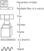

Introduction
============

There are a lot of "standards" when it comes to networking. One
organization that makes some of those standards
is the International Organization for Standardization (ISO).
ISO created a standard called the
Open Systems Interconnection model (OSI model).

Yes, ISO created OSI. The acronyms are just reversed.

OSI Model
---------

OSI divides up the concept of networking into seven layers:

1. Physical
2. Data-Link
3. Networking
4. Transport
5. Session
6. Presentation
7. Application

This book is organized around these layers. We are going to start at the Physical
layer and work our way up to the Presentation Layer. As for the Application
layer? We could write another whole other book on that.

OSI is a *conceptual* model. There isn't a specific "implementation" of any layer
in this model.
What the OSI model does is help with, is when you talk to other people about networking.
It also helps when
you want to break apart a complex networking problem into smaller logical parts.
You know when you talk about the "east-side" of your town? Exactly what fits into
that definition is a little fuzzy and can change a bit over time, but the
term gives most people an idea of what part of town you are talking about.
It works the same way with OSI layers.

It is worth remembering the name of each layer and their order.
The physical layer is considered "layer 1."
If you talk to a networking expert and mention that some process happens at
the "networking layer", or "layer 3" they will know what you are talking about.
It is such a popular way to talk about networking that there are even companies
named after "layer 3."

If you have trouble remembering the layer names, use
the mnemonic "Please Do Not Touch
Steve's Pet Alligator." Take the first letter from each word of that sentence,
and you have the first letter of each layer.

What does each layer do?
------------------------

At the application layer, the user interacts with our application.
For example, we can
give a thumbs-up to a video we like.
Each OSI layer works to process that "thumbs-up", passing it down
to a lower layer until our request is finally turned into a signal on a wire.

When we receive data at the physical layer, we pass it up all the layers until
we finally hit the application layer where we store that information in a database.

.. image:: osi_model.svg
    :align: center
    :alt: alternate text

Incoming Data
-------------

What might it look like when we *receive* a web page?

1. Physical: Translates pulses of electricity,
   radio waves, or light to 1's and 0's. When new data is received, the
   physical layer will pass that data up to the data-link layer.
2. Data-Link: Decodes the data from the physical layer into chunks of data called
   "frames". A frame has a data "payload" and if the frame is addressed for
   this computer and uncorrupted, it is passed up to the networking layer. Otherwise
   it is ignored.
3. Networking: Each chunk of data at this level is called a "packet."
   At the networking level, we look to see if this the final destination for
   the packet. If it is, pass
   it up a level. If not, figure out the next "hop" to pass the packet to.
   Pass the packet back down to the data-link level to go to that hop.
   The networking layer *routes* packets.
4. Transport: Takes the data contained in the packets, and reassembles them
   into the original file, image, or larger data stream. If we are missing data,
   we'll ask for it again. We will also pass it to the correct program on the
   computer that is expecting the data.
5. Session: At this level we track a whole "conversation." So if multiple files
   are being sent, we'll know to send them to the right user. We'll also decrypt
   and uncompress any zipped up data at this level.
6. Presentation: This is where we display information. We might combine images,
   web files, and style documents together to render a web page at this level.
7. Application: At this level, we interact with the user and wait for a "thumbs up"
   or "thumbs down" on our post.

Outgoing Data
-------------

What if the user clicks a "thumbs-up" on the video? The layers might work
like this:

1. Application: Realize the user pressed a mouse button on the document. Pass
   that down to the presentation layer.
2. Presentation: Receive that the user pressed the "thumbs up" icon. Turn that
   into a small file that holds info on which thumbs-up was clicked.
3. Session: Add information about who the user was. Encrypt the message. Compress
   it.
4. Transport: Take the file and break it into smaller packet-sized parts.
5. Networking: Add an address with our final destination. We probably aren't going
   to get there in one hop. Figure out what the next hop will be.
6. Data-link: Add an address for our next hop.
7. Turn the data into electrical pulses on a wire.

OSI Model vs. Reality
---------------------

That's the theory behind the OSI model. But in reality? The technologies
we use don't always fit neatly into those layers.

You may have heard of **Ethernet**. Ethernet is a set of protocols for networking
we use when we network with cables or wirelessly.
It covers both the Physical (layer 1) and the Data-Link (layer 2).

You may have heard of **TCP/IP**. It is the one of the main protocols that
gets Internet traffic to its destination. TCP/IP stands for Transmission Control
Protocol/Internet Protocol. IP covers networking (layer 3), TCP covers
transport (layer 4). Mostly.

The display of web pages, PDFs, images, even 3D graphics
fall under presentation (layer 6), while the management of menus, buttons and other
are covered by the application (layer 7).

Just remember, many of the boundaries between these layers are fuzzy,
and not clearly defined. Often technologies do tasks outside of what
their "layer", and software may lump multiple layers together.

Review
------

* What does ISO stand for, and what is it?
* What does OSI stand for?
* What is each layer of the OSI model and what does it do?
* Do real networking implementation fall neatly into the OSI model?