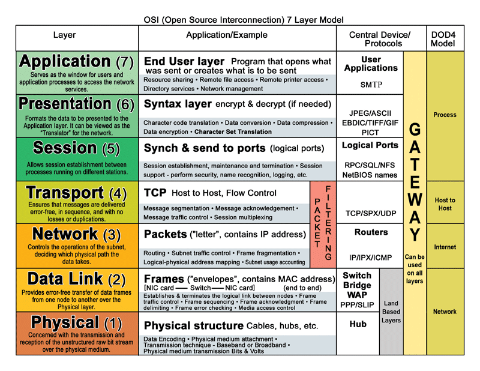

Seven Layer Network Model
=========================

Networking computers requires standards. We want to be able to have our computers,
routers, cables, and wireless all work together regardless as to what vendor created
the product.

There are many organizations that make standards used in networking. One
such organization is the International Organization for Standardization (ISO)
based in Switzerland. ISO created a standard called the
Open Systems Interconnection model (OSI model).

OSI divides up the concept of networking into seven layers.

OSI is a *conceptual* model.

In class we will cover the following topics. Follow the links for detailed
information.

* What is ISO_?

* What is the `OSI model`_?

  * Make sure you can briefly name each layer
  * Make sure you can describe each layer
  * Be ready to be called on in class to do so

* Learn "Please Do No Touch Steve's Pet Alligator" as a mnemonic to learn
  the different OSI model layers.

For quick reference and explanation, I like this graphic I got from
`Building Automation Monthly`_.

Study it in detail.

A good portion of the class will be dedicated to understanding all seven layers.
We will start with the physical layer and work our way up. The end of class
will be focused on the security aspects of networking.

.. _ISO: https://en.wikipedia.org/wiki/International_Organization_for_Standardization
.. _OSI Model: https://en.wikipedia.org/wiki/OSI_model
.. _Building Automation Monthly: http://blog.buildingautomationmonthly.com/what-is-the-osi-model/