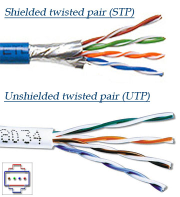
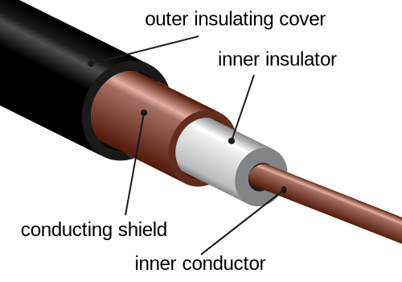
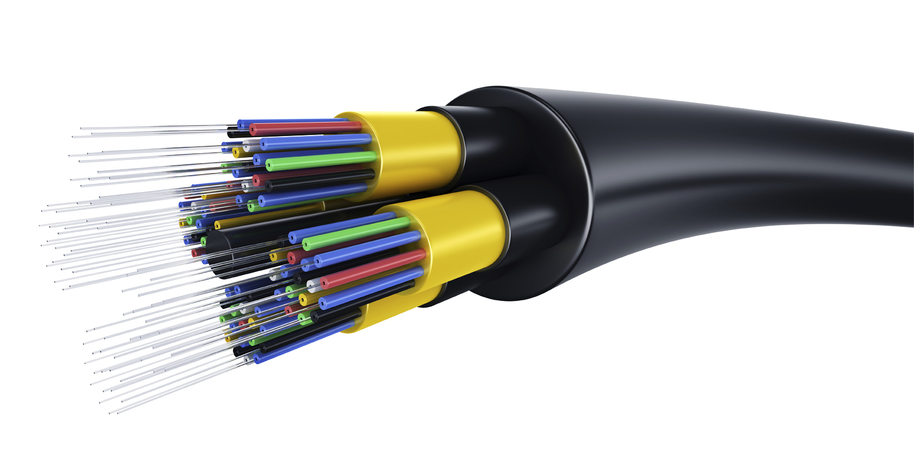
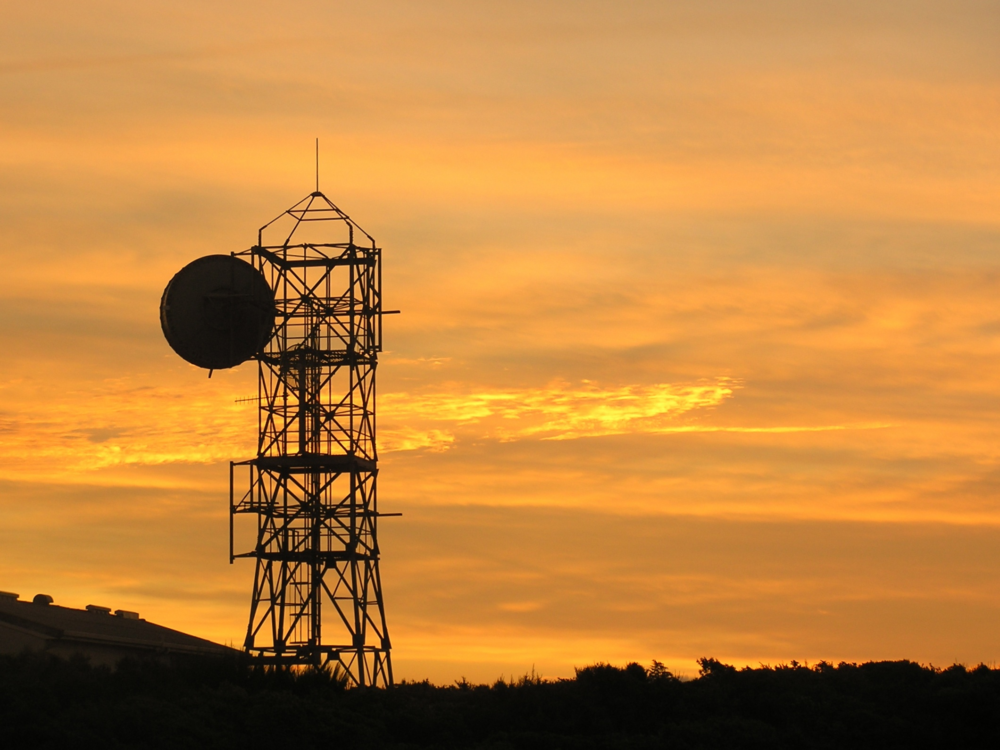
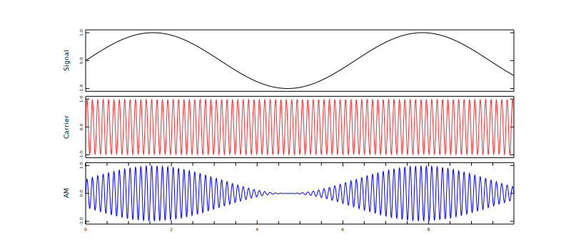
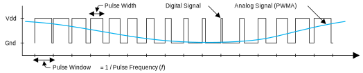

Physical Layer Theory
=====================

When we communicate by talking in person, our message is carried
by sound waves. Those sound waves are our
**communication medium**. Communication medium is the channel
or system that a sender transmits a message to a receiver.
When we network computers, we work with several different
types of communication medium.

The three most frequently used mediums for computer networking are:

* Electricity transmitted over a wire
* Light transmitted over fiber optics
* Radio waves broadcast everywhere with an antenna, or directed with a dish

Wire as a Medium
----------------

Wire transmits our signals by electrical pulses along a some kind of
material that conducts electricity.

Normally we need at least two conductors, as electricity works better
when it has a closed path for the electricity to flow. That's why
batteries have both a positive and negative side.
Electrons flow out of the negative side and back into the positive
side.

For example, we can encode ones and zeros by alternating the
direction the electrons are flowing:

But electricity on a wire is prone to interference and loss.
Electricity flowing through a wire creates magnetism, which
can cause us to lose the signal. Also, magnetic fields can
create electricity in wires, which can cause us to get new
signals on the wire we don't want. We call this "noise" or
"interference."

Engineers and scientists have spent a lot of time trying
to come up with ways to minimize the loss and interference
for signals traveling on a wire.

One common trick, run two wires.
Have electricity flow in opposite directions. We call this a **balanced line**.

What if we get noise or interference on the wire? Chances are, it will affect
both wires, in the same direction:

So when we receive our signal, we invert the signal on one of the wires, then
add the signal on both wires together. That way the noise is canceled out!
This is called **differential signaling**.

Using a balanced line and differential signaling helps get a cleaner signal
further. To get an even cleaner signal, we can twist the wire. This helps
keep any noise introduced to the wires to be the same for both wires. Otherwise the
wire closest to the noise will pick up more noise and we can't completely
cancel it out. Twisting also helps with reducing loss
of signal. This type of wire is called **twisted pair**.
Sometimes we just abbreviate this TP, which works great unless you talk to
a non-network engineer who might think you are talking about Toilet Paper.

There are many standards for the construction of twisted pair cable.
Most cable standards used in wiring networks in a building today different
fall under the "Cat 5",
"Cat 5e" or "Cat 6" standards. Cat is short for category.
Any of these cable types work fine for most networking.
Lower numbered categories below 5 may not reliably handle speeds of modern networks.

Cables can be made out of **stranded wire** or **solid-core** wire. Solid-core
wire transmits signal better than stranded wire and usually is the better choice.
However stranded cable is more flexible and bends easier, so sometimes stranded is
a popular choice for short patch cables that you'll coil and uncoil frequently.

You can buy **shielded cables** that have foil wrapped around them to reduce
interference. Yes, even your cables can have tin-foil hats.

* Shielded (STP) or Unshielded (UTP) Twisted Pair (Image from Pace University)

We can also use `coaxial cable`_. Coaxial cable (sometimes
just called coax) is used for transmitting high frequency signals. While TP
is used for transmitting digital (on/off) signals, coax is used for transmitting
analog signals with frequencies just like radio waves. In fact, coax can be
used to carry radio signals directly to the antenna for broadcast. Coax uses
a center conductor (wire) surrounded by an insulator, surrounded by an outer
conductor.

.. image:: RG-59.jpg
    :width: 500px
    :align: center
    :alt: From Wikipedia Commons

Light as a Medium
-----------------

Instead of communicating with a wire, we can communicate with light.
We can direct the light with **fiber optics**. Fiber optics uses glass
to bounce a laser light inside the "wire" until it reaches the end.

Fiber optics provide some advantages over wire:

* Fiber optics don't lose signal because of electromagnetic loss, nor
  do they pick up noise from stray magnetic fields. This means we can
  send our signal further with fiber.
  Fiber optics can go so far, that we have cables which go under the ocean
  all the way from America to Europe.
* Fiber optics can transmit more data, faster, than wire can.

But there are drawbacks:

* Connecting fiber optic cable is more difficult.
* At each end, you need more electronics to send and receive signals than
  you do with wire. You have to convert from electricity to light, then
  from light back to electricity again.

There are some great videos that visually show how fiber optics work. I
recommend searching for videos on "`how do fiber optics work`_" if you want
to know more.

You don't have to use fiber optics to communicate with light. Many TV remotes
communicate with an Infra-Red (IR) light to communicate with your TV.

Radio as a Medium
-----------------

There's a lot to radio waves as a medium, more than what we can cover in this
book. However, we can get started learning some of the most critical parts  .

We communicate via radio based on the **frequency** of the radio waves. For example,
you can listen to music based on radio frequency, when you tune into 90.1 MHz
(90.1 million cycles per second) on your FM car
radio. You might listen to AM radio at 1040 kHz (1,040 thousand cycles
per second). Your WiFi might run at 2.5 GHz (2.5 billion cycles per second).

When communicating via radio, we don't broadcast just at 90.1 MHz. We broadcast
a bit above and below that frequency as well. The FM radio we are used to
listening to goes about 90 kHz up and 90kHz down from 90.1 MHz, for a total
width of 180 kHz. We call this the **bandwidth**. The more bandwidth we
use, the more data that can be transmitted.

Radio waves act differently depending on their frequency.
Lower frequencies tend to travel further than higher frequency
waves. It is entirely possible to transmit from one side of the
Earth to the other using lower frequency waves. On the other
hand, high frequencies have more bandwidth for faster data
transmission. And you don't have to worry about interference
from the other side of the globe. **Radio wave
propagation** is how these radio waves travel, bounce, and get
absorbed.

It is worth taking a bit of time to look up and review the
`electromagnetic spectrum`_ to see all of these different
frequencies. To make sure people and devices don't
interfere with each other, we set aside parts of the spectrum for
different uses. You can look up the `United States Spectrum Allocation
Chart`_ for more information on how we divide this up in the US.

Most of the standards for wireless communication have been put
together by the Institute of Electrical and Electronics Engineers
(IEEE). Many of these standards are part of the IEEE
standard numbered "802.11".
As more updated standards are made, they add letters to the end of the
802.11 standard.

For computers, we typically use these frequencies and standards
in the United States:

* 2.4 GHz (802.11b/g/n/ax and Bluetooth)
* 5 GHz (802.11a/h/j/n/ac/ax)

Inside these ranges, there are different "channels" that can be
selected. If you are having problems with your wireless because too
many other people have wireless routers running, you can
use tools to find if there are other channels your can set your router
to that will have less interference.

* Microwave links

Another important-to-know method of communicating data is by radio and satellite.
This has the advantage of being able to communication between any two points
that can see the same satellite, or any satellite that is part of a network.
So you can communicate from in the middle of the ocean, in the country,
or while travelling where it is impractical to get a wired connection.

Satellites used for communication often
are in `geosynchronous orbit`_. Geosynchronous orbit is when a satellite orbits
at exactly the same speed that the Earth rotates. This means to a person on the
Earth, the satellite appears to be in the same spot in the sky. It is useful because
you can aim a dish at the satellite and not have to move it.

However, there are disadvantages to this. To get a geosynchronous orbit, the
satellite must be about 35,786 km (22,236 mi) above sea level. Why is that
an issue? Let's do some math.

Speed of light:

.. math::

   c = 299,792,458\;\text{m/s}

Distance:

.. math::

   d = 35,786\;\text{km}

   d = 35,786,000\;\text{m}

Round-trip time formula:

.. math::

   t = \frac{2d}{c}

Fill in the formula:

.. math::

   t = \frac{2 \cdot 357,786,000}{299,792,458}

Solve:

.. math::

   t \approx 0.24\;\text{seconds}

Therefore, any time you want to do something over the network, it will take
an extra quarter second to get from you to the server because of the satellite.
An extra half second if you want a reply.
This is not a problem some types of communication like
TV shows, but it is a problem if you have to wait an extra 0.5 seconds
for every mouse click, or you add that delay into a conversation over the
phone with people.

.. _geosynchronous orbit: https://en.wikipedia.org/wiki/Geosynchronous_satellite

Another way to do satellite communication is to have not just one
satellite in a geosynchronous orbit, but a whole lot of satellites
zooming around closer to the Earth in `Low Earth Orbit`_ (LEO). Because
the satellites are closer, you don't have as much delay. But you have
to launch and maintain a lot more satellites.

If you want to know more about radio waves, I'd suggest
searching up how to get an **amateur radio license** in your country. There
are many books that cover projects you can do with radio waves.

Types of Communicating
----------------------

You should be familiar with the following terms with doing
communication.

* **Simplex** (Transmit one way using one channel, such as broadcast radio)
* **Half duplex** (Transmit two ways using one channel. Note you can't talk and
  listen at the same time because there's only one channel.
  Think old-style walkie-talkies or CB radio.)
* **Full duplex** (Transmit two ways using two channels or pairs of wires.
  Both can talk and listen at the same time. This is just like talking
  on the phone.)

So if you want to sent/receive at the same time, you need two channels
of communication.

Types of Modulation
-------------------

When talk and listen, we typically can hear frequencies between 20 Hz and 22 kHz. How
do we take those frequencies and transmit them over the radio at a much higher frequency?
How do we take an analog signal like music and save it digitally when we only have 1's and 0's?

This process of translating the signal to a different signal is called **modulation**.
Going the other way, we call it **demodulation**.

Amplitude Modulation
~~~~~~~~~~~~~~~~~~~~

The earliest form of modulation invented for transmitting voice by radio
is called **Amplitude Modulation** (AM). If you've used AM radio, you've
used Amplitude Modulation.

AM takes the audio signal (top) with the AM frequency (such as 1040 kHz)
which we call the **carrier frequency** (middle). This leaves us with our
AM modulated signal (bottom):

    Image from "Introduction To Digital Modulation" by Doug Hoyte

Unfortunately AM wastes a lot of power and any electromagnetic noise from
things like motors or lightning can be decoded as audio pops and crackles
instead of being ignored.

Frequency Modulation
~~~~~~~~~~~~~~~~~~~~

Another way to modulate audio signals into a radio frequency is by
**frequency modulation** (FM). Any time you listen to FM radio you
are using frequency modulation.

Rather than change the amplitude of our carrier based on the signal
we want to modulate, we will change our frequency. So our carrier
frequency might go between 90.0 MHz to 90.2 MHz.

    "Frequency_Modulation.svg" retrieved from Wikipedia

Pulse Code Modulation
~~~~~~~~~~~~~~~~~~~~~

`Pulse Code Modulation`_ (PCM)

    "Pcm.svg" Image from Wikipedia

Pulse Width Modulation
~~~~~~~~~~~~~~~~~~~~~~

`Pulse Width Modulation`_ (PWM)

    `Image from Real Digital <https://www.realdigital.org/doc/333049590c67cb553fc7f9880b2f79c3>`_

Clock and Data Lines
--------------------

This uses two wires. One wire is a clock signal, which operates on a regular
interval. The other signal is a data signal.

On the "rising edge" of the clock signal, the data signal is transitioned
to either high or low, depending on the data. We don't read the data at this
point because it is still transitioning. When the clock signal falls we hold
the data signal at the proper value. The receiver will read from the data
line whenever the clock signal is in a falling state.

.. image:: clock_signal.svg
    :width: 500px
    :align: center

* `Manchester Encoding`_
* `8b 10b Encoding`_
* (There are many others)

.. _Twisted Pair: https://en.wikipedia.org/wiki/Twisted_pair
.. _Coaxial Cable: https://en.wikipedia.org/wiki/Coaxial_cable
.. _how do fiber optics work: https://www.youtube.com/watch?v=0MwMkBET_5I
.. _Amplitude Modulation: https://en.wikipedia.org/wiki/Amplitude_modulation
.. _Frequency Modulation: https://en.wikipedia.org/wiki/Frequency_modulation
.. _Pulse Code Modulation: https://en.wikipedia.org/wiki/Pulse-code_modulation
.. _Pulse Width Modulation: https://en.wikipedia.org/wiki/Pulse-width_modulation
.. _Manchester Encoding: https://en.wikipedia.org/wiki/Manchester_code
.. _types of wifi standards: https://en.wikipedia.org/wiki/IEEE_802.11
.. _Clock and data signal: https://learn.sparkfun.com/tutorials/serial-peripheral-interface-spi
.. _Low Earth Orbit: https://en.wikipedia.org/wiki/Low_Earth_orbit
.. _8b 10b Encoding: https://en.wikipedia.org/wiki/8b/10b_encoding
.. _United States Spectrum Allocation Chart: https://upload.wikimedia.org/wikipedia/commons/d/df/United_States_Frequency_Allocations_Chart_2011_-_The_Radio_Spectrum.pdf
.. _Electromagnetic Spectrum: https://en.wikipedia.org/wiki/Electromagnetic_spectrum
.. _Radio Wave Propagation: http://www.pac-attack.com/articles/radio-wave-propagation

Review
------

* Define: communication medium
* What are the three most common mediums for computer networking?
* Define: balanced line
* Define: differential signaling
* Define: twisted pair
* Define: Cat 6 cable
* When would you use solid-core wire vs. stranded wire?
* What is coax cable and when do you use it?
* What is a fiber optic cable? What is it made of?
* How does light stay in a fiber optic cable?
* What is radio wave propagation?
* Explain the electromagnetic spectrum.
* Transmitting via a satellite in geosynchronous orbit adds about how much of a delay? Why?
* What is the difference between simplex, half-duplex, and duplex?

