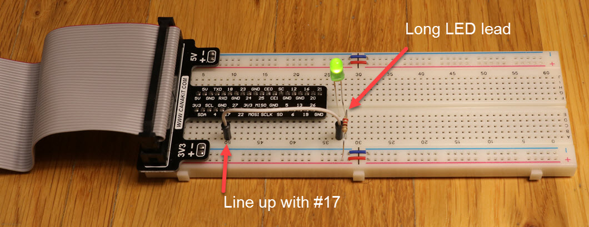
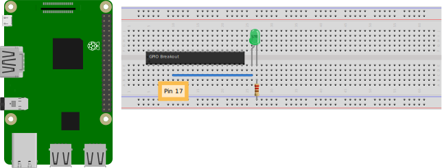
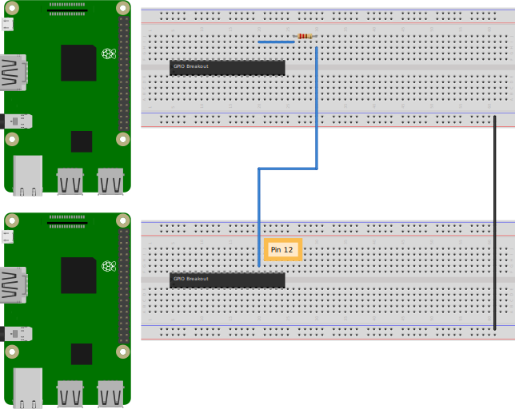

.. _gpio_tutorial:

Tutorial: Raspberry Pi GPIO
===========================

Step one: Blink an LED
----------------------

Let's blink an LED. We will use something called a "breadboard." A breadboard
is a handy way to connect wires without soldering. Each five hole column is
connected together. Each long strip on the bottom and top are connected
horizontally. Usually we use that for the + side of the power, and the - side
of the power. We also call the negative side the "ground."

So we can plug wires into holes that are on the same column, and they will be
connected.

Set up your Raspberry Pi like this photo:

We will put in a jumper wire to the breakout labeled "17." Then we will run
that wire to an empty column on the right. Then plug in the long (positive)
side of the LED into a different hole in that column. Plug the short (negative)
side of the LED into the column to the right.

Then in that same column run a resistor from the positive side of the LED to the
negative power rail (ground).

What is a resistor? It "resists" the flow of electricity. You know it is bad
to hook up the positive and negative parts of a battery together because it makes
a short circuit. But if we put in a resistor it will slow the flow of
electricity down to a reasonable amount. The colors on the resistor tell us
how much resistance there is.

The LED has a positive and a negative side. It won't work if inserted backwards.

The resistor does not have a positive or negative side. There is no forwards
or backwards for it.

Here's another image if this helps:

Great! Now we can run a Python program to blink the LED. Try the program
below:

.. literalinclude:: led_blink.py
    :linenos:
    :language: python

When the GPIO pin is set "high" electricity flows and the LED lights up. When
it is set "low" the LED goes out.

(Side note, instead of hooking the LED to ground if you hook it to the
positive rail then everything is backwards. When you set the GPIO pin to low,
the LED lights up. When you set it to high it goes out. If you try it, remember
you have to flip the LED so the positive is still on the positive side of the
electricity flow.)

Step two: Signal another Raspberry Pi
-------------------------------------

Now, find a friend and let's get your computers talking.

Let's use pin 12, in case you want to keep your blinking LED.

* Tie the grounds of both boards together
* Run a wire from pin 12 on one board, to a 220 (red, red, brown) resistor.
  Then run the resistor to number 12 pin on the other board.

Now that they are hooked up, let's run some code. On one computer we will
run a program to alternate the pin 12 between high and low:

.. literalinclude:: send_wire.py
    :linenos:
    :language: python

And on the other computer, let's read that wire:

.. literalinclude:: read_wire_poll.py
    :linenos:
    :language: python

Great! But what we are doing is "polling." We are periodically seeing if the value changes.
So if it doesn't change, we are wasting time. If it changes faster than we are polling, then
we miss changes. Polling is no good.

Instead, we can wait for the wire to change between high and low:

.. literalinclude:: read_wire_wait.py
    :linenos:
    :language: python

This is much better. But still not great. Because this is "blocking." Our program can't do anything
unless there is a change in state on the wire. If there is never a change, we just hang.

A better option? Use a callback. Write a function that the computer will run when there is a
change in state. The function is run in a separate thread.

.. literalinclude:: read_wire_callback.py
    :caption: read_wire_callback.py
    :name: read_wire_callback
    :linenos:
    :language: python

