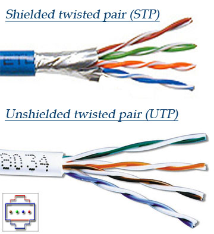
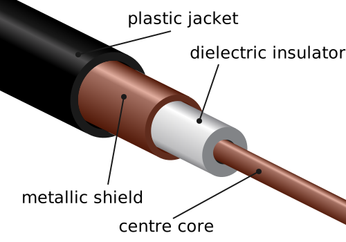
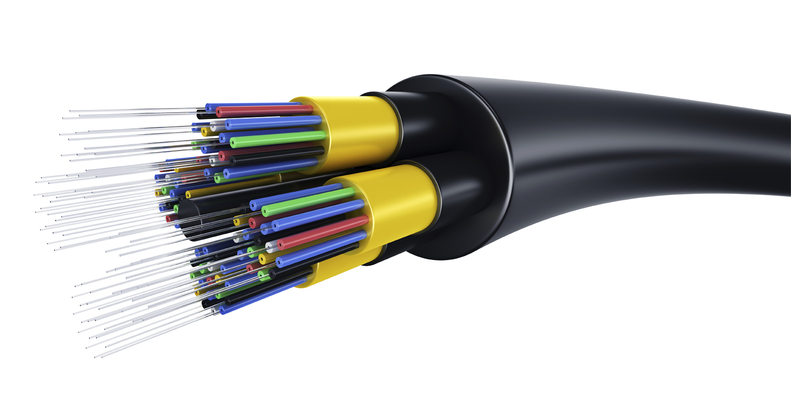
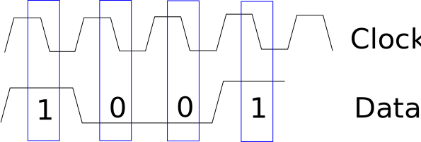

Physical Layer Theory
=====================

When we communicate by talking in person, our message is carried
by sound waves. That method of communication we call our
**communication medium**. When we network computers, we work with several different
types of communication medium.

Types of Communication Medium
-----------------------------

The three most frequently used mediums for computer networking are:

* Electricity transmitted over a wire
* Light transmitted over fiber optics
* Radio waves broadcast everywhere with an antenna, or directed with a dish

Wire as a Medium
^^^^^^^^^^^^^^^^

Wire transmits our signals by electrical pulses along a some kind of
material that conducts electricity.

Normally we need at least two conductors, as electricity works better
when it has a closed path for the electricity to flow. That's why
batteries have both a positive and negative side.
Electrons flow out of the negative side and back into the positive
side.

For example, we can encode ones and zeros by alternating the
direction the electrons are flowing:

But electricity on a wire is prone to interference and loss.
Electricity flowing through a wire creates magnetism, which
can cause us to lose the signal. Also, magnetic fields can
create electricity in wires, which can cause us to get new
signals on the wire we don't want. We call this "noise" or
"interference."

Engineers and scientists have spent a lot of time trying
to come up with ways to minimize the loss and interference
for signals traveling on a wire.

One common trick, run two wires.
Have electricity flow in opposite directions. We call this a **balanced line**.

.. image:: signal_02.svg
    :width: 500px
    :alt: Signal on a wire

What if we get noise or interference on the wire? Chances are, it will affect
both wires, in the same direction:

So when we receive our signal, we invert the signal on one of the wires, then
add the signal on both wires together. That way the noise is canceled out!
This is called **differential signaling**.

Using a balanced line and differential signaling helps get a cleaner signal
further. To get an even cleaner signal, we can twist the wire. This helps
keep any noise introduced to the wires to be the same for both wires. Otherwise the
wire closest to the noise will pick up more noise and we can't completely
cancel it out. Twisting also helps with reducing loss
of signal. This type of wire is called **twisted pair**.
Sometimes we just abbreviate this TP, which works great unless you talk to
a non-network engineer who might think you are talking about Toilet Paper.

There are many standards for the construction of twisted pair cable.
Most cable standards used in wiring networks in a building today different
fall under the "Cat 5",
"Cat 5e" or "Cat6" standards. Cat is short for category.
Any of these cable types work fine for most networking.
Lower numbered categories below 5 may not reliably handle speeds of modern networks.

Cables can be made out of **stranded wire** or **solid-core** wire. Solid-core
wire transmits signal better than stranded wire and usually is the better choice.
However stranded cable is more flexible and bends easier, so sometimes stranded is
a popular choice for short patch cables that you'll coil and uncoil frequently.

You can buy **shielded cables** that have foil wrapped around them to reduce
interference. Yes, even your cables can have tin-foil hats.

* Shielded (STP) or Unshielded (UTP) Twisted Pair (Image from Pace University)

* `Coaxial Cable`_

.. image:: RG-59.jpg
    :width: 500px
    :align: center
    :alt: From Wikipedia Commons

Light as a Medium
^^^^^^^^^^^^^^^^^

Instead of communicating with a wire, we can communicate with light.
We can direct the light with **fiber optics**. Fiber optics uses glass
to bounce a laser light inside the "wire" until it reaches the end.

Fiber optics provide some advantages over wire:

* Fiber optics don't lose signal because of electromagnetic loss, nor
  do they pick up noise from stray magnetic fields. This means we can
  send our signal further with fiber.
  Fiber optics can go so far, that we have cables which go under the ocean
  all the way from America to Europe.
* Fiber optics can transmit more data, faster, than wire can.

But there are drawbacks:

* Connecting fiber optic cable is more difficult.
* At each end, you need more electronics to send and receive signals than
  you do with wire. You have to convert from electricity to light, then
  from light back to electricity again.

There are some great videos that visually show how fiber optics work. I
recommend searching for videos on "`how do fiber optics work`_" if you want
to know more.

You don't have to use fiber optics to communicate with light. Many TV remotes
communicate with an Infra-Red (IR) light to communicate with your TV.

Radio as a Medium
^^^^^^^^^^^^^^^^^

* `Electromagnetic Spectrum`_
* `United States Spectrum Allocation Chart`_
* `Radio Wave Propagation`_
* Bluetooth
* Wi-Fi (see `types of wifi standards`_)
* Microwave links

.. image:: Microwave_tower_silhouette-2.jpg
    :width: 500px
    :align: center
    :alt: From Wikipedia Commons

* Satellite

  * `Low Earth Orbit`_
  * Geosynchronous_

    * What is geosynchronous?
    * How far up is a geosynchronous orbit?

      * Approximately 35,786 km (22,236 mi) above sea level

    * How long does it take light to make the round trip?

Speed of light:

.. math::

   c = 299,792,458\;\text{m/s}

Distance:

.. math::

   d = 35,786\;\text{km}

   d = 35,786,000\;\text{m}

Round-trip time formula:

.. math::

   t = \frac{2d}{c}

Fill in the formula:

.. math::

   t = \frac{2 \cdot 357,786,000}{299,792,458}

Solve:

.. math::

   t \approx 0.24\;\text{seconds}

Types of communicating
^^^^^^^^^^^^^^^^^^^^^^

* Simplex (One way, broadcast radio)
* Half duplex (Two ways, but can't talk and listen. Walkie-talkies.)
* `Full duplex`_ (Both can talk and here. Phone.)

Encoding
^^^^^^^^

Types of encoding digital onto analog:

* `Amplitude Modulation`_ (AM)
* `Frequency Modulation`_ (FM)

Types of encoding analog onto digital:

* `Pulse Code Modulation`_ (PCM)
* `Pulse Width Modulation`_ (PWM)

Ways to put bits on a wire:

* `Clock and data signal`_

This uses two wires. One wire is a clock signal, which operates on a regular
interval. The other signal is a data signal.

On the "rising edge" of the clock signal, the data signal is transitioned
to either high or low, depending on the data. We don't read the data at this
point because it is still transitioning. When the clock signal falls we hold
the data signal at the proper value. The receiver will read from the data
line whenever the clock signal is in a falling state.

* `Manchester Encoding`_
* `8b 10b Encoding`_
* (There are many others)

.. _Twisted Pair: https://en.wikipedia.org/wiki/Twisted_pair
.. _Coaxial Cable: https://en.wikipedia.org/wiki/Coaxial_cable
.. _how do fiber optics work: https://www.youtube.com/watch?v=0MwMkBET_5I
.. _Amplitude Modulation: https://en.wikipedia.org/wiki/Amplitude_modulation
.. _Frequency Modulation: https://en.wikipedia.org/wiki/Frequency_modulation
.. _Pulse Code Modulation: https://en.wikipedia.org/wiki/Pulse-code_modulation
.. _Pulse Width Modulation: https://en.wikipedia.org/wiki/Pulse-width_modulation
.. _Manchester Encoding: https://en.wikipedia.org/wiki/Manchester_code
.. _types of wifi standards: https://en.wikipedia.org/wiki/IEEE_802.11
.. _Clock and data signal: https://learn.sparkfun.com/tutorials/serial-peripheral-interface-spi
.. _Full duplex: https://en.wikipedia.org/wiki/Duplex_(telecommunications)
.. _Geosynchronous: https://en.wikipedia.org/wiki/Geosynchronous_satellite
.. _Low Earth Orbit: https://en.wikipedia.org/wiki/Low_Earth_orbit
.. _8b 10b Encoding: https://en.wikipedia.org/wiki/8b/10b_encoding
.. _United States Spectrum Allocation Chart: https://upload.wikimedia.org/wikipedia/commons/d/df/United_States_Frequency_Allocations_Chart_2011_-_The_Radio_Spectrum.pdf
.. _Electromagnetic Spectrum: https://en.wikipedia.org/wiki/Electromagnetic_spectrum
.. _Radio Wave Propagation: http://www.pac-attack.com/articles/radio-wave-propagation