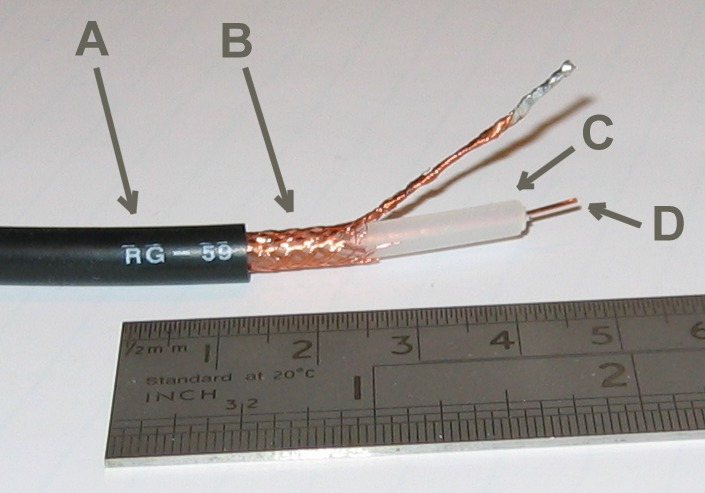

Physical Layer
==============

Types of communication medium
-----------------------------

* Wire (guided)
* Light (guided or possibly unguided)
* Radio (unguided)

Wire
^^^^

* Regular wire
* `Twisted Pair`_ - TP. Why is it twisted?

.. image:: Twisted-Pair-AlDmour.jpg
    :width: 500px
    :align: center
    :alt: alternate text

* Shielded (STP) or Unshielded (UTP) Twisted Pair (Image from Pace University)

* `Coaxial Cable`_

.. image:: coaxial_cable_cutaway.svg
    :width: 500px
    :align: center
    :alt: From Wikipedia Commons

Light
^^^^^

* IR (like older TV remotes)
* Laser + fiber optics (see `how fiber optics work`_) (Image from Apollo
  Technology)

.. image:: fibre_bundle.jpg
    :width: 500px
    :align: center
    :alt: From http://apollotech.com.au/product-category/fibre-optic-cable/

Radio
^^^^^

* `Electromagnetic Spectrum`_
* `United States Spectrum Allocation Chart`_
* `Radio Wave Propagation`_
* Bluetooth
* Wi-Fi (see `types of wifi standards`_)
* Microwave links

.. image:: Microwave_tower_silhouette-2.jpg
    :width: 500px
    :align: center
    :alt: From Wikipedia Commons

* Satellite

  * `Low Earth Orbit`_
  * Geosynchronous_

    * What is geosynchronous?
    * How far up is a geosynchronous orbit?

      * Approximately 35,786 km (22,236 mi) above sea level

    * How long does it take light to make the round trip?

Speed of light:

.. math::

   c = 299,792,458\;\text{m/s}

Distance:

.. math::

   d = 35,786\;\text{km}

   d = 35,786,000\;\text{m}

Round-trip time formula:

.. math::

   t = \frac{2d}{c}

Fill in the formula:

.. math::

   t = \frac{2 \cdot 357,786,000}{299,792,458}

Solve:

.. math::

   t \approx 0.24\;\text{seconds}

Types of communicating
^^^^^^^^^^^^^^^^^^^^^^

* Simplex (One way, broadcast radio)
* Half duplex (Two ways, but can't talk and listen. Walkie-talkies.)
* `Full duplex`_ (Both can talk and here. Phone.)

Encoding
^^^^^^^^

Types of encoding digital onto analog:

* `Amplitude Modulation`_ (AM)
* `Frequency Modulation`_ (FM)

Types of encoding analog onto digital:

* `Pulse Code Modulation`_ (PCM)
* `Pulse Width Modulation`_ (PWM)

Ways to put bits on a wire:

* `Clock and data signal`_

This uses two wires. One wire is a clock signal, which operates on a regular
interval. The other signal is a data signal.

On the "rising edge" of the clock signal, the data signal is transitioned
to either high or low, depending on the data. We don't read the data at this
point because it is still transitioning. When the clock signal falls we hold
the data signal at the proper value. The receiver will read from the data
line whenever the clock signal is in a falling state.

.. image:: clock_signal.svg
    :width: 500px
    :align: center

* `Manchester Encoding`_
* `8b 10b Encoding`_
* (There are many others)

.. _Twisted Pair: https://en.wikipedia.org/wiki/Twisted_pair
.. _Coaxial Cable: https://en.wikipedia.org/wiki/Coaxial_cable
.. _how fiber optics work: https://www.youtube.com/watch?v=9VmA2S2XiCo
.. _Amplitude Modulation: https://en.wikipedia.org/wiki/Amplitude_modulation
.. _Frequency Modulation: https://en.wikipedia.org/wiki/Frequency_modulation
.. _Pulse Code Modulation: https://en.wikipedia.org/wiki/Pulse-code_modulation
.. _Pulse Width Modulation: https://en.wikipedia.org/wiki/Pulse-width_modulation
.. _Manchester Encoding: https://en.wikipedia.org/wiki/Manchester_code
.. _types of wifi standards: https://en.wikipedia.org/wiki/IEEE_802.11
.. _Clock and data signal: https://learn.sparkfun.com/tutorials/serial-peripheral-interface-spi
.. _Full duplex: https://en.wikipedia.org/wiki/Duplex_(telecommunications)
.. _Geosynchronous: https://en.wikipedia.org/wiki/Geosynchronous_satellite
.. _Low Earth Orbit: https://en.wikipedia.org/wiki/Low_Earth_orbit
.. _8b 10b Encoding: https://en.wikipedia.org/wiki/8b/10b_encoding
.. _United States Spectrum Allocation Chart: https://upload.wikimedia.org/wikipedia/commons/d/df/United_States_Frequency_Allocations_Chart_2011_-_The_Radio_Spectrum.pdf
.. _Electromagnetic Spectrum: https://en.wikipedia.org/wiki/Electromagnetic_spectrum
.. _Radio Wave Propagation: http://www.pac-attack.com/articles/radio-wave-propagation