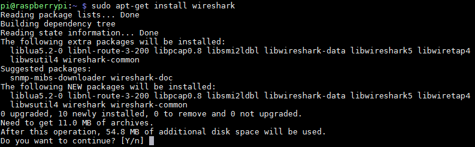
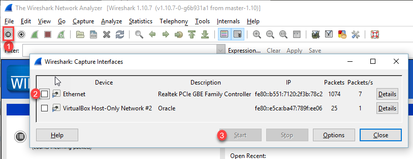

.. _wireshark-tutorial:

Wireshark Tutorial
==================

Wireshark Linux
---------------

Installation
^^^^^^^^^^^^
Install Wireshark_ on your Raspberry Pi with:

``sudo apt-get install wireshark``

Then go ahead and type "y" to confirm:

**Important:** You will get a warning that starts off by
"Dumpcap can be installed..." You can select the default "No".
We will run Wireshark as root.

Running Wireshark
-----------------

To run Wireshart as root, use the command:

``sudo wireshark``

Running Windowed Applications Remotely
^^^^^^^^^^^^^^^^^^^^^^^^^^^^^^^^^^^^^^

Oh, but wait. Do you want to run Wireshark remotely? Thankfully with Linux,
running a windowed application remotely *is* possible.
This is because Linux and similar operating systems use
`X Windows`_.
systems separate the windowing system into several layers:

* Application
* Windowing communications (which can go over a network connection)
* Windowing system
* Windows manager (which adds the boarders, close buttons, and other
  things around the window. There are several managers. See
  `Best Windows Managers`_)

MobaXTerm will not only support character applications, but you can start
a windowed application, and it will run on the remote computer, but show up
on yours. You can start the web browser, Epiphany_, with:

``epiphany``

Then you will see the web browser on your computer, even though it is running
on the remote computer.

Note that the terminal will "hang" and not let you enter more commands until you
finish with your web browser. You can start the application, and run it in the
background by adding an ampersand:

``epiphany &``

This works with any command on Linux.

**BUT** If you are running Wireshark remotely over MobaXTerm or similar,
you have to run with administrator privileges. You are doing low-level
network stuff, after all.
And running remote windowed apps as root will likely fail.

This is because by default the root user doesn't have a
``.Xauthority`` file we need. So first to work remotely, copy it over:

``sudo cp .Xauthority /root``

Then you should be able to start Wireshark:

``sudo wireshark``

Windows doesn't separate these into layers, and isn't as flexible, so you can't
do any of this fun remote windowing stuff.

Windows
-------

But wait! You can also download and install Wireshark on your PC!

Feel free to download and run Wireshark on your own laptop.
However Linux allows more control
over the network card that Wireshark, so there are some things you can't do
with Wireshark on Windows.

Warning - Don't get fired!
--------------------------

Some people consider Wireshark an "offensive weapon" in the area of network
security. They will not want it hooked up to their network. Depending on policy,
at a workplace or school it could lead to disciplinary action.

And I just told you to feel free to download Wireshark on your own laptop.

There is a lot of misconceptions around what Wireshark can and can't do.
Even amongst people who consider themselves experts.
It won't make arguing your case any easier if you do get into trouble.

In the case of Simpson, the administration currently does not want Wireshark
on the campus network. Keep to using our locally-created networks created just
for this class that you can happily mess up all you want.

So feel free to download Wireshark to your laptop. Unless you want to hook it
up to Simpson's network.

Start capture
^^^^^^^^^^^^^

The button to start capture isn't very obvious. You also need to select the
network adapter to capture:

After the capture, you might have too many packets. You can filter the packets
with a special `Wireshark filter language`_.

.. _Wireshark filter language: https://wiki.wireshark.org/DisplayFilters
.. _Wireshark: https://www.wireshark.org/
.. _X Windows: https://en.wikipedia.org/wiki/X_Window_System
.. _Best Windows Managers: https://www.linux.com/news/best-linux-desktop-environments-2016
.. _Epiphany: https://en.wikipedia.org/wiki/Web_(web_browser)