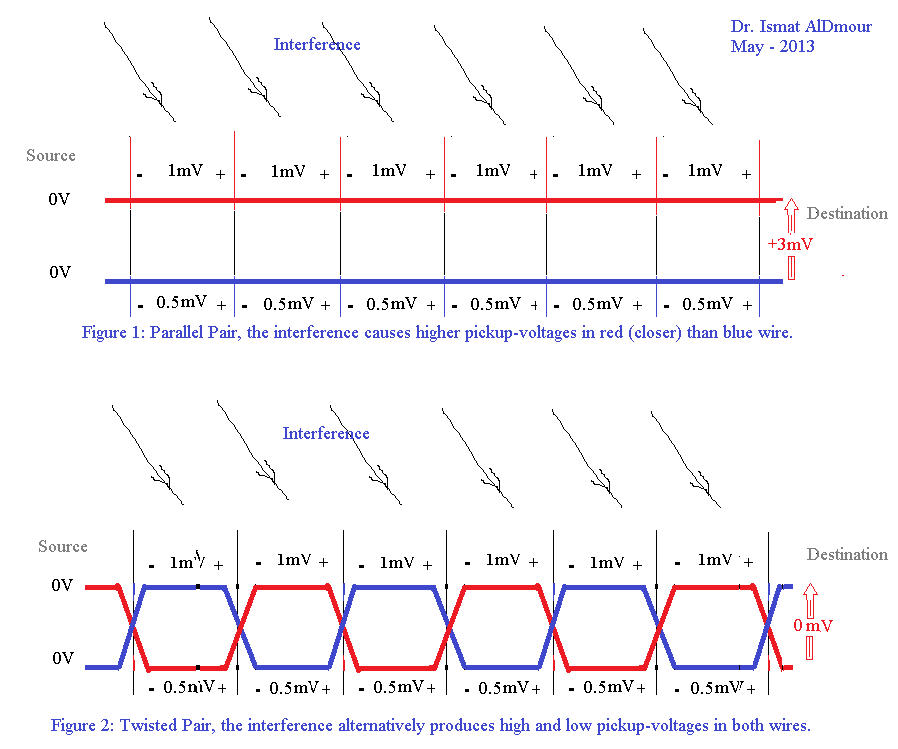

Physical Layer
==============

Talk about the different types of transmission mediums:

* Wire (guided)
* Light (guided or possibly unguided)
* Radio (unguided)

Wire:

* Regular wire
* `Twisted Pair`_ - TP, Shielded or unshielded

* `Coaxial Cable`_

Light:

* IR (like older TV remotes)
* Laser + fiber optics See `how fiber optics work`_

Radio:

* Bluetooth
* Wi-Fi (See `types of wifi standards`_)
* Microwave links

.. image:: https://upload.wikimedia.org/wikipedia/commons/f/f6/Microwave_tower_silhouette-2.jpg
    :width: 500px
    :align: center

* Satellite

  * Low Earth Orbit
  * Geosynchronous

  	* What is geosynchronous?
    * How far up is a geosynchronous orbit?
    * How long does it take light to make the round trip?

Types of communicating:

* Simplex
* Half duplex
* Full duplex

Types of encoding digital onto analog:

* `Amplitude Modulation`_ (AM)
* `Frequency Modulation`_ (FM)

Types of encoding analog onto digital:

* `Pulse Code Modulation`_ (PCM)
* `Pulse Width Modulation`_ (PWM)

Ways to put bits on a wire:

* Data + clock wires
* `Manchester Encoding`_

.. _Twisted Pair: https://en.wikipedia.org/wiki/Twisted_pair
.. _Coaxial Cable: https://en.wikipedia.org/wiki/Coaxial_cable
.. _how fiber optics work: https://www.youtube.com/watch?v=9VmA2S2XiCo
.. _Amplitude Modulation: https://en.wikipedia.org/wiki/Amplitude_modulation
.. _Frequency Modulation: https://en.wikipedia.org/wiki/Frequency_modulation
.. _Pulse Code Modulation: https://en.wikipedia.org/wiki/Pulse-code_modulation
.. _Pulse Width Modulation: https://en.wikipedia.org/wiki/Pulse-width_modulation
.. _Manchester Encoding: https://en.wikipedia.org/wiki/Manchester_code
.. _types of wifi standards: https://en.wikipedia.org/wiki/IEEE_802.11

