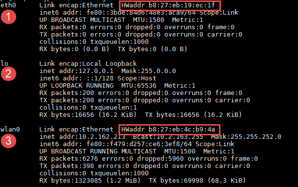
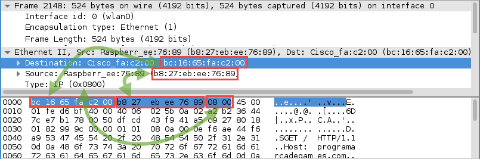

.. _datalink-layer:

Data Link Layer
===============

The data link layer bundles up all the bits into a *frame* and sends it along
the wire to another computer. Data link does not manage routing from computer to
computer.

Computers can have multiple network adapters. These are officially known as
Network Interface Cards or NIC for short. Often, network adapters are now
built into the motherboard for the computer, and they are no longer separate
cards. But the NIC term remains.

Each network adapter has a Layer 2 address. This is set by default and should be different
on each computer. The Layer 2 address is the `Media Access Control`_ (MAC) address.
This is not the IP address that you hear so much about.

Look at the result of typing ``ifconfig`` below. (Remember on Windows it is
``ipconfig``.)

This Raspberry Pi has three adapters. Adapter one is ``eth0``. It is the wired
Ethernet adapter.

Adapter two is ``lo``. It is a *virtual* adapter. There is no real network adapter.
It is called the loopback_. It allows a computer to create a
network connection with itself. For example, this allows a person to run a
webserver, and also run a webserver on the same computer. A person can do this
with no network adapter, because the loopback is the virtual adapter that manages
this.

Adapter three is ``wlan0``. This is the wireless adapter. The ``HWaddr`` is the
Layer 2 MAC address.

Ethernet Frame
--------------

Wikipedia has a good article describing the `Ethernet frame`_. Read through
that article and describe each of these parts (image from Wikipedia Commons):

.. image:: ethernet_frame.svg
    :width: 550px
    :align: center
    :alt: https://commons.wikimedia.org/wiki/File:Ethernet_frame.svg

* What is the Preamble, and SFD? How does that relate to the work we did for
  the Layer 1 lab?
* What are the Destination and Source MAC address fields?
* What is the EtherType? (Ethernet II is normally what you see.)
* What is the Payload?
* What is the FCS?
* How large can an Ethernet frame get (1522 bytes. Which means a
  TCP/IP packet might be split between multiple frames.)

Below is a sample Layer-2 data frame captured by the program Wireshark:

At the bottom are all the bytes captures by Wireshark. Each byte is shown as
a two-digit `hexadecimal`_ number.

* Each hexadecimal digit represents how many bits?
* Each two-digit hexadecimal number represents a decimal number from up to
  what value?
* What parts of the frame does is the Wireshark capture NOT showing? (Most
  network adapters will strip these parts before passing them "up" the
  OSI stack. So Wireshark can't see them.)

.. _Ethernet frame: https://en.wikipedia.org/wiki/Ethernet_frame
.. _Hexadecimal: https://en.wikipedia.org/wiki/Hexadecimal
.. _Media Access Control: https://en.wikipedia.org/wiki/MAC_address:
.. _loopback: https://en.wikipedia.org/wiki/Loopback

