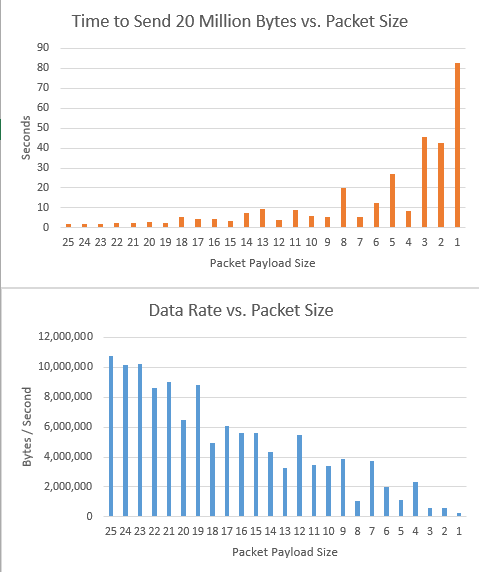

Lab 4: Transport Layer
----------------------

========  ===== ======
Step      Grade Points
========  ===== ======
No steps  F     0
Step 1    F     55
Step 2    D     65
Step 3    C     75
Step 4    B     85
Step 5    A     95
Step 6    A     100
========  ===== ======

Handshaking
^^^^^^^^^^^

* Read how `TCP handshaking`_ occurs when building a connection.
* Examine the code at :ref:`tcp_tutorial`.
* Run a Wireshark packet trace to see the data go across the line.
* Show the packet capture and explain the packets and how the connection is built.

Packet Sizes
^^^^^^^^^^^^

* Examine first few code examples at :ref:`tcp_tutorial` for sending and receiving.
* Set up your workspace so your sender and receiver are on different computers.
* Run a Wireshark packet trace to see the data go across the line.
* Figure out how many characters can you send before the data will be split
  into multiple packets.
* Show the packet capture and explain your results.

Data Transmission Rates and Packet Sizes
^^^^^^^^^^^^^^^^^^^^^^^^^^^^^^^^^^^^^^^^

* Examine last few code examples at :ref:`tcp_tutorial`.
* Note how the examples find data transmission rates. For example, if your
  message was 2 bytes long, and you were able to send/receive 5,000 of these
  in 7 seconds, you have a data transmission rate of:

.. math::

  \frac{packets \cdot size}{time} = \frac{ 5000 \cdot 2}{7} = 1,429\:bytes/sec

* Modify the code so that you find the timings of packets from 1 byte of
  payload up to 25. You may need to do multiple runs and throw out outliers.
* Graph the results. Here is my graph.

* Find one data point, perhaps 10 bytes of payload, and find the time difference
  if you were to setup and tear down the connection between each 10 byte chunk,
  or if you were to leave the connection open.

Bouncing Balls
^^^^^^^^^^^^^^

The goal of this project is to get bouncing ball on the computer screen to pass
from one computer to another. So if you line up five laptops, the ball will
appear to bounce across all the screens.

* Examine the code at :ref:`tcp_tutorial`.
* Get a "bouncing ball" program to work. Either
  `this Pygame one <http://programarcadegames.com/python_examples/f.php?file=bouncing_balls.py>`_
  or `this Arcade one <https://pythonhosted.org/arcade/examples/bouncing_balls.html>`_
* Create variables to hold what computer is to your left and right.

  * Set them for address and port on "left" and "right" side

* If the variables are set to null or None, ignore them and have the program
  operate as normal.
* If the variable is set, then when the ball hits the left or right side, open
  a connection, send the following numbers over the network:

``y,change_x,change_y<carriage return>``

For example:

``50,-3,2\n``

To get that information ready to **send**, you will likely need to use
`print formatting <http://programarcadegames.com/index.php?chapter=formatting>`_.
That will allow you to convert from a integer to a string.

Print formatting gives you a string, rather than a byte array, so to convert
as string to a byte array::

    my_byte_array = bytearray(my_string, "UTF-8")

After you **receive** that string, you need to convert it back from a string to an
integer. You will likely need to use the python ``split`` function to split the
string into parts::

  string_list = my_string.split(",")

And then convert the strings into integers like this::

  y = int(string_list[0])

* Close the connection after sending.
* Add TCP listeners for the left and for the right.
* If you receive numbers, add a new ball with the appropriate y value and vector.
* Set up your computers so you get the ball bouncing between screens.
* Feel free to help each other out with the coding. If you are done, PLEASE be
  mindful of other people still coding. Don't make lots of noise and distract
  them from finishing. Stick around and help them integrate with your code.
* The code can be visually more pleasing if you include size and color.

Threaded Bouncing Balls
^^^^^^^^^^^^^^^^^^^^^^^

* Instead of non-blocking calls in your main program loop, figure out how to
  create separate receiving threads to manage the network connections. (No
  need to thread the sending.)
* For an example of using threads in Python, see: :ref:`thread_tutorial`

Foreign Bouncing Balls
^^^^^^^^^^^^^^^^^^^^^^

* Create a threaded on non-threaded bouncing ball program in a language other
  than Python. Like Java for example. See :ref:`java_ball_bounce`

.. _TCP handshaking: https://en.wikipedia.org/wiki/Transmission_Control_Protocol

