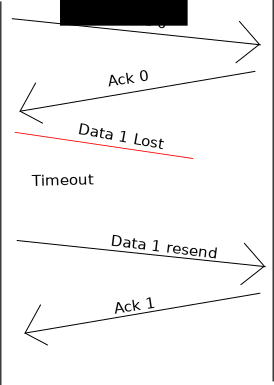
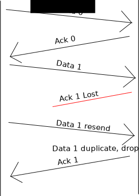

Transport Layer
===============

Sliding Window Protocol
-----------------------

The transport layer features reliable, in-order transmission of data. How
do we do this? Data packets can get lost!

The simplest way is to send "acknowledgment packet" each time we receive data.
To keep things short, we call these "ACK" packets.

Sliding window, size of one
^^^^^^^^^^^^^^^^^^^^^^^^^^^

We need to number our data and ack packets to prevent duplication of our payload.
So we will flip between 0 and 1 as our simple numbering system.

The sending computer will "stop and wait" for an "ok" or "ack" after each chunk
of data it sends. Here it is in action:

    Using acknowledgments, no data loss

Great, but what if our data gets lost? Or corrupted? The sender will "timeout"
and re-send the data.

    Using acknowledgments, lost packet Data 1

What if the data gets there, but the "ack" is lost? Here's what happens:

    Using acknowledgments, lost Ack 1

Note if we get a duplicate, we drop it, but go ahead and "ack" anyway.
Sometimes like my students who laugh when I tell the same joke over.

**Timeouts:** If a timeout is set too long, then the sender is left "hanging"
when he/she could be sending data. Time is wasted. If the timeout is set too
short, then mass confusion happens:

.. figure:: sliding-windows-protocol.jpg
    :width: 340px
    :alt: alternate text

    Sliding window. Slide from `Gondwe Ben <http://www.slideshare.net/GondweBenard/module15>`_

Sliding window, size larger than one
^^^^^^^^^^^^^^^^^^^^^^^^^^^^^^^^^^^^

This constant back and forth is slow. Think how much faster we'd be if we
sent two packets, then did one ack that covered both? Or send 10 data
packets and wait for an "ack" that covered all 10?

    Timed out too early

This is a *sliding window*. What we described before was a sliding window,
but of size one. Here is a nice animation of a sliding window in action:

https://www.youtube.com/watch?v=EHaSQBOrYDI

This helps make sure the sender doesn't send data faster than the receiver
process it as well.

Sliding window, TCP style
^^^^^^^^^^^^^^^^^^^^^^^^^

https://www.youtube.com/watch?v=McDNzBvRPHA

Transmission Control Protocol
-----------------------------

TCP

Sliding Window Protocol
^^^^^^^^^^^^^^^^^^^^^^^

Also good for flow control.

Asynchronous Transfer Mode
--------------------------

ATM

Frame Relay
