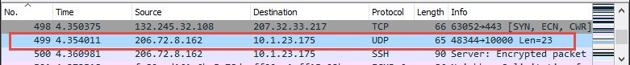
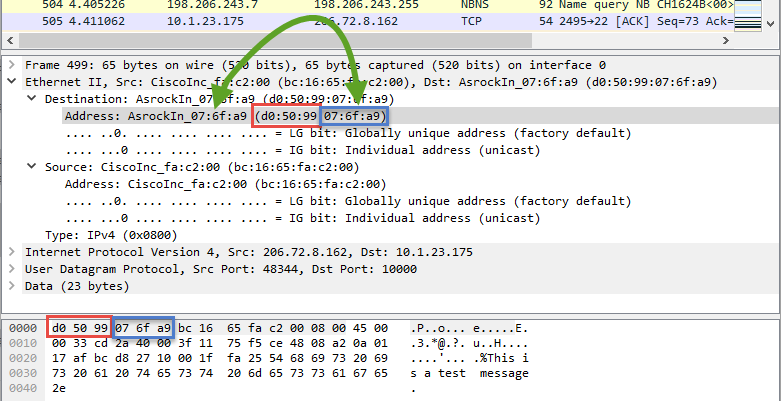
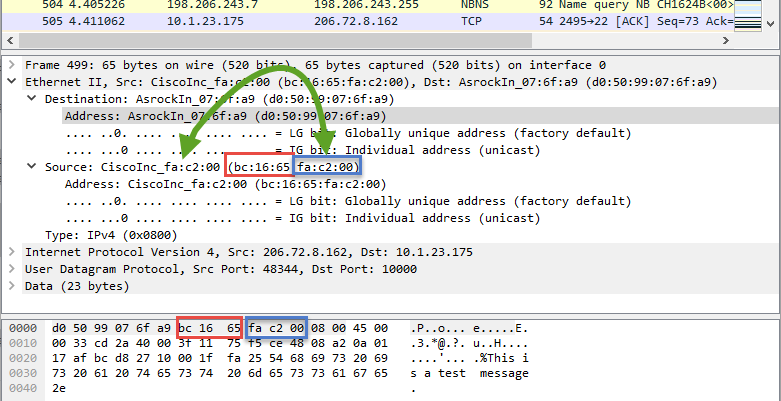
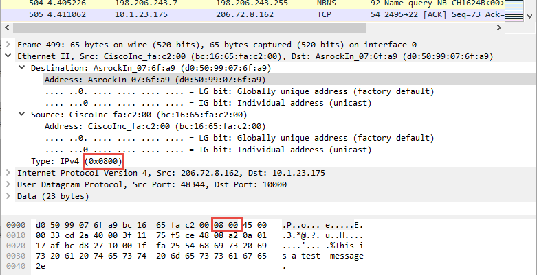
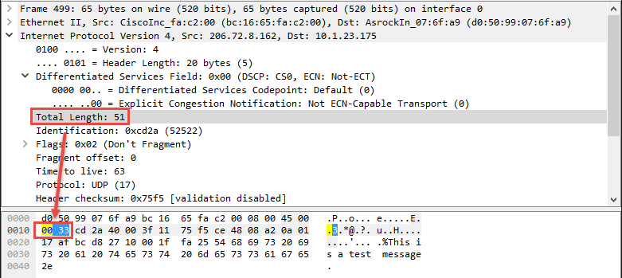
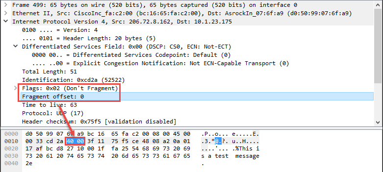
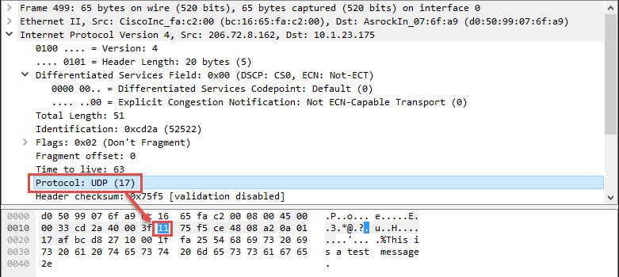
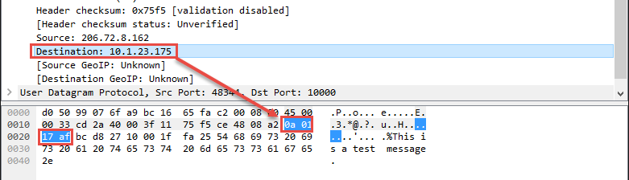
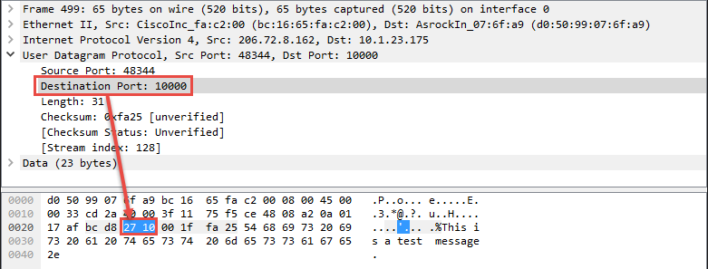
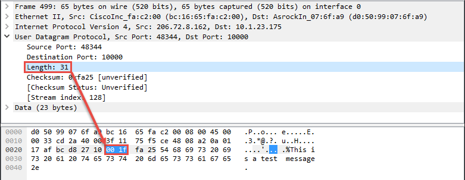

.. _datagram_tutorial:

Send and Receive Datagrams
==========================

Send Datagram
-------------
.. literalinclude:: send_datagram.py
    :linenos:
    :language: python

Receive Datagram - Blocking
---------------------------

.. literalinclude:: receive_datagram.py
    :linenos:
    :language: python

Receive Datagram - Non-Blocking
-------------------------------

.. literalinclude:: receive_datagram_nonblocking.py
    :linenos:
    :language: python

Packet Structure
----------------

I have used these programs to send myself a packet. I captured it with
Wireshark. Let's deconstruct the packet.

Ethernet
^^^^^^^^

The first six bytes are the destination address. The first three of those are
unique to each device, the second three are unique to the manufacturer.
In my case, the destination computer motherboard was built by ASRock.

The IEEE keeps a
`registry <https://regauth.standards.ieee.org/standards-ra-web/pub/view.html#registries>`_
of what manufacturer gets what 3 digit MAC address. You can do a
`MAC address lookup <http://www.macvendors.com/>`_ to find out the manufacturer.

The next six bytes is the source address. This is **not** the computer that
originally sent the message. In this case, it is the Cisco router that is
between the source computer and the destination computer.

Then we set the type of Ethernet packet to Ethernet II using 0x0800.

IP
^^

Finally, we reach the TCP/IP part of the packet! The next byte 0x45 holds two
pieces of data. Four bits represent the version of TCP/IP we are using (TCPv4)
and the next to say how long the header is (20 bytes). Note that this is length
of the header, not the entire message. Together those eight bits gives us the next
byte.

.. image:: udp_05.png
    :width: 640px
    :align: center
    :alt: alternate text

.. image:: udp_06.png
    :width: 640px
    :align: center
    :alt: alternate text

.. image:: udp_08.png
    :width: 640px
    :align: center
    :alt: alternate text

.. image:: udp_10.png
    :width: 640px
    :align: center
    :alt: alternate text

.. image:: udp_12.png
    :width: 640px
    :align: center
    :alt: alternate text

.. image:: udp_13.png
    :width: 640px
    :align: center
    :alt: alternate text

UDP
^^^

.. image:: udp_15.png
    :width: 640px
    :align: center
    :alt: alternate text

.. image:: udp_18.png
    :width: 640px
    :align: center
    :alt: alternate text

Data/Payload
^^^^^^^^^^^^

.. image:: udp_19.png
    :width: 640px
    :align: center
    :alt: alternate text

