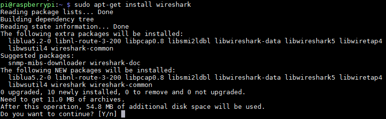

Wireshark
=========

Wireshark Installation
----------------------

Linux
^^^^^
Install Wireshark_ on your Raspberry Pi with:

``sudo apt-get install wireshark``

Then go ahead and type "y" to confirm:

**Important:** You will get a warning that starts off by
"Dumpcap can be installed..." You can select the default "No".
We will run Wireshark as root.

**BUT** Wireshark will likely fail because by default the root user doesn't have a
``.Xauthority`` file we need. So first, copy it over:

``sudo cp .Xauthority /root``

Next, start Wireshark:

``sudo wireshark``

Windows
^^^^^^^

You can also download and install Wireshark on your PC.

Sending Raw Ethernet
--------------------

Here is code that will send raw Ethernet packets:

https://gist.github.com/austinmarton/1922600

You can compile the code with:

``gcc sendRawEth.c -o send``

This will use the Gnu C Compiler ``gcc`` to compile the C program ``sendRawEth.c``
and save the output as ``send``.

You can run the program with:

``sudo ./send``

You need admin privilages to send raw data frames. Also, you need the ``./``
because by default root users to not try to run commands from the current directory.
(For security reasons.)

Here is a program to receive packets:

https://gist.github.com/austinmarton/2862515

.. _Wireshark: https://www.wireshark.org/

